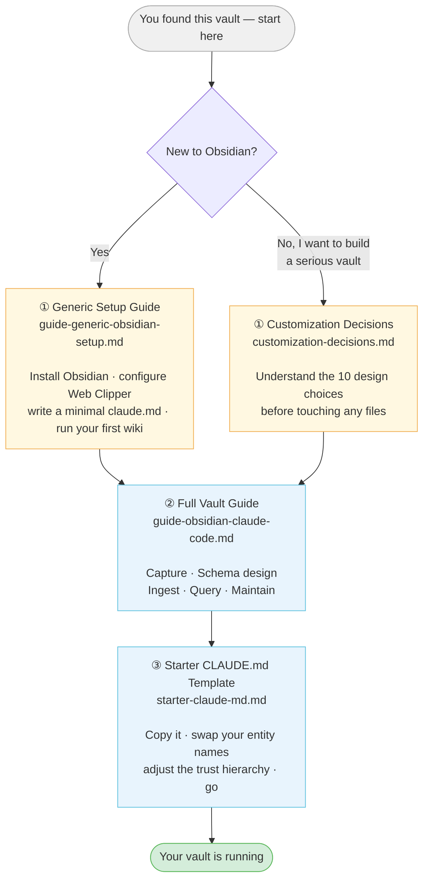

# Where to Start: Reading Guide

Use this diagram to find your entry point based on where you are.

---

## The four guides at a glance

| # | File | Best for | Time |
|---|------|----------|------|
| ① | [Generic Setup Guide](guide-generic-obsidian-setup.md) | Complete beginners — never used Obsidian | ~30 min |
| ① | [Customization Decisions](customization-decisions.md) | Already know Obsidian, want to build something robust | ~10 min |
| ② | [Full Vault Guide](guide-obsidian-claude-code.md) | Anyone ready to run the full ingest → query → maintain loop | ~20 min |
| ③ | [Starter CLAUDE.md Template](starter-claude-md.md) | Copy and adapt when building your own vault | Reference |

---

## What each guide gives you

**[Generic Setup Guide](guide-generic-obsidian-setup.md)**
The six-step baseline from scratch: download Obsidian, create `raw/` and `wiki/`, write a minimal `claude.md`, configure Web Clipper to route clips into `raw/`, install Local Images Plus, ask Claude Code to generate your first wiki. Ends with a note on where the generic pattern hits its limits.

**[Customization Decisions](customization-decisions.md)**
A side-by-side comparison of the generic setup versus the design choices made in this vault — typed entity folders, schema-driven CLAUDE.md, source provenance, conflict detection, trust hierarchy, audit log, and more. Includes a build checklist so you can adapt these decisions for your own domain.

**[Full Vault Guide](guide-obsidian-claude-code.md)**
The complete operational playbook: how to capture content with Web Clipper, how to design a schema, exact Claude Code prompt patterns for ingesting single files, batches, and long documents, how to query the vault and file analyses, and how to maintain it over time with lint and supersession.

**[Starter CLAUDE.md Template](starter-claude-md.md)**
A fully worked, copy-ready schema — not a skeleton with brackets. Concrete page templates for source, topic, organization, concept, and analysis pages. Complete ingest, query, and lint workflows. A ranked document trust hierarchy. Swap out the entity names and domain taxonomy and you have a working schema in under an hour.
